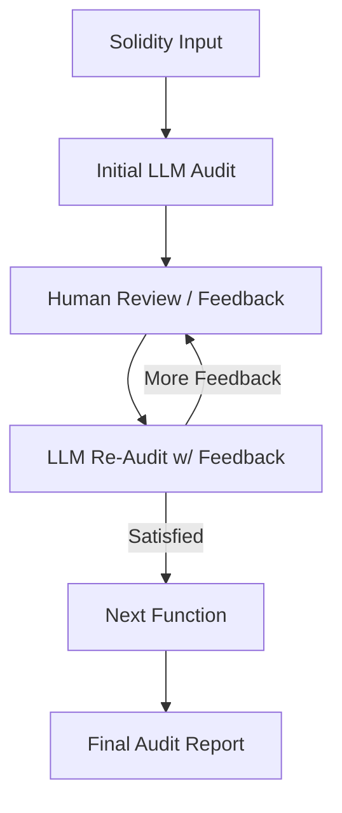

# 🧠 Human-in-the-Loop Smart Contract Auditing Assistant

Built with 💡 **LlamaIndex**, 🤖 **OpenAI GPT-4o**, and 🧑‍💻 **Python**  
This project is a real-time, feedback-driven smart contract auditing assistant—where the **AI listens**, the **human directs**, and the audit gets **better with every loop**.

---

## 🎯 What It Does

This tool lets you:
- Input raw Solidity smart contract functions
- Run an initial AI-powered security audit (summary, risks, suggestions)
- Provide **natural language feedback**
- Watch the AI regenerate the audit **with your comments incorporated**
- Repeat until you approve ✅

It's inspired by the LlamaIndex [Choose Your Own Adventure Workflow](https://github.com/run-llama/llama_index/blob/main/docs/docs/examples/workflow/human_in_the_loop_story_crafting.ipynb)—but adapted for smart contract auditing workflows.

---

## 📹 Demo

Watch the live demo on Loom:  
[▶️ Watch Demo](https://www.loom.com/share/3a474d9d5ba1464692e2dc4269f221cd?sid=cb87e34a-bc8e-40ff-988e-873054f8bed8)

---

## 🛠️ Tech Stack

- **LlamaIndex Workflow API**
- **OpenAI GPT-4o**
- **Pydantic for audit structuring**
- **Async Python workflow**

---

## 🌀 Workflow Structure

---

## 🙏 Credits & Glory

Built by @bassmajor_ (Eddie Otudor) with help from the Holy Spirit & assistance from ChatGPT 🤝

“To GOD be the glory.”
